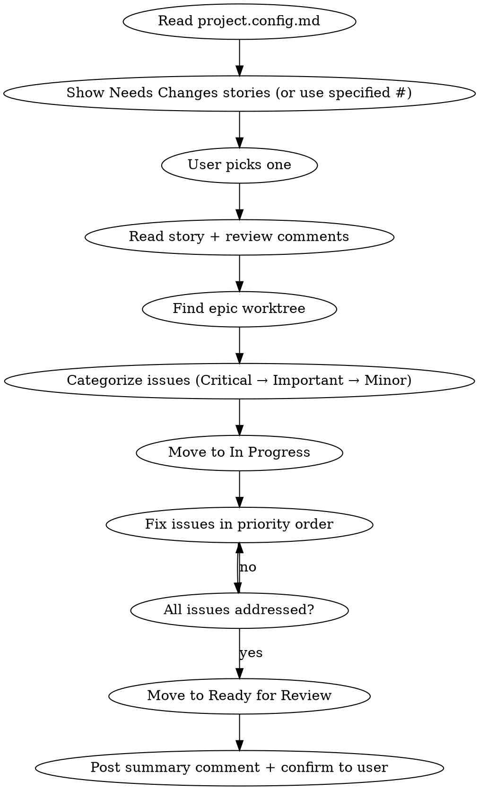

# Fix — Address Review Feedback

Pick up a story from Needs Changes, read the review feedback, fix the issues in the epic's worktree, and resubmit for review.

**REQUIRED:** Read `.claude/project.config.md` first to get repo, project, build, and status settings. If the file doesn't exist, tell the user to run `/setup` first.

The user's input is: $ARGUMENTS

## Usage

- `/fix` — shows stories that need changes
- `/fix 31` — fix issue #31 directly

## Flow



## Process

### 1. Select Story
- Read `.claude/project.config.md` for all project settings
- If `$ARGUMENTS` contains an issue number, use it directly
- Otherwise, run `~/.claude-helpers/get-issues.sh --stage needs-changes`, then present the candidates using the `AskUserQuestion` tool. Proceed with the picked number
- Fetch the full issue body and all comments (review feedback is in comments)

### 2. Read Review Feedback
- Parse the review comment for issues by severity:
  - **Critical (Must Fix)** — address first
  - **Important (Should Fix)** — address second
  - **Minor (Nice to Have)** — address if reasonable
- Present the issues to the user for confirmation before starting

### 3. Find the Worktree
- Identify the parent epic number
- Find the epic's worktree (it should still exist from implementation):
  ```bash
  git worktree list | grep "feat/<epic-number>"
  ```
- `cd` into the worktree

### 4. Fix Issues
- Move story to **In Progress**: `~/.claude-helpers/issue-set-stage.sh <story> in-progress`
- Wait for explicit go-ahead from the user
- Work through issues in priority order: Critical → Important → Minor
- Follow the reviewer's "How to fix" suggestions where provided
- After fixing, run lint + typecheck from config to verify nothing is broken

### 5. Resubmit
- Post a comment on the issue summarizing what was fixed:
  ```markdown
  ## Fixes Applied
  
  - [x] Critical: <what was fixed>
  - [x] Important: <what was fixed>
  - [x] Minor: <what was fixed / skipped with reason>
  ```
- Move story back to **Ready for Review**: `~/.claude-helpers/issue-set-stage.sh <story> ready-for-review`

## Commands

- **List candidates**: `~/.claude-helpers/get-issues.sh --stage needs-changes`
- **Read story + comments**: `gh issue view <number> --repo <repo> --comments`
- **Post fix summary**: `gh issue comment <number> --repo <repo> --body-file <path>`
- **Change status**: `~/.claude-helpers/issue-set-stage.sh <num> <stage>`

## Important

- Always read ALL review comments — there may be multiple rounds of feedback
- Fix Critical issues first, never skip them
- Post a summary comment so the reviewer knows what changed
- Run lint + typecheck before resubmitting
- The worktree should already exist — if it doesn't, something went wrong
