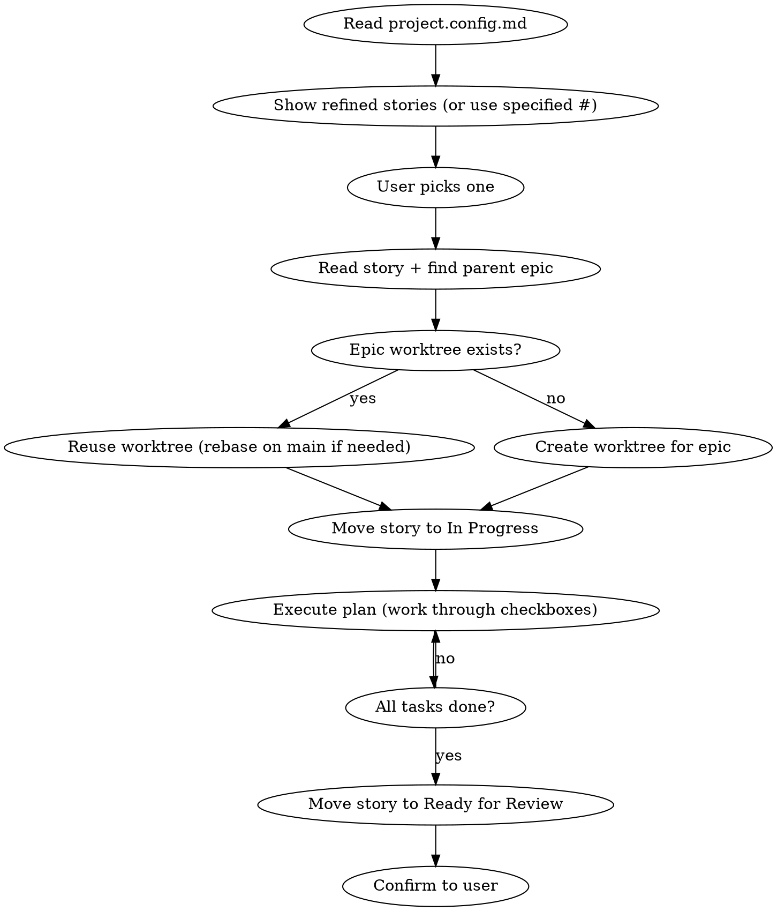

# Implement — Execute a Refined Story

Pick up a refined story from the board and implement it in an isolated git worktree scoped to its parent epic.

**REQUIRED:** Read `.claude/project.config.md` first to get repo, project, and build settings. If the file doesn't exist, tell the user to run `/setup` first.

The user's input is: $ARGUMENTS

**REQUIRED:** Use `superpowers:using-git-worktrees` for worktree creation (only if one doesn't exist yet for this epic).

## Usage

- `/implement` — shows refined stories to pick from
- `/implement 31` — implement issue #31 directly

## Flow



## Process

### 1. Select Story
- Read `.claude/project.config.md` for all project settings
- If `$ARGUMENTS` contains an issue number, use it directly
- Otherwise, run `~/.claude-helpers/get-issues.sh --type story --stage backlog`, then present the candidates using the `AskUserQuestion` tool (one option per line, format `#NUM - Title`). Proceed with the picked number
- Fetch the full issue body (contains user story, acceptance criteria, and implementation plan with task checkboxes)
- Identify the parent epic via the sub-issues API

### 2. Setup — Worktree per Epic
**Check if a worktree already exists for this epic:**
```bash
git worktree list | grep "feat/<epic-number>"
```

**If worktree exists:**
- `cd` into the existing worktree
- Rebase on main if main has moved ahead:
  ```bash
  git fetch origin main && git rebase origin/main
  ```

**If no worktree exists:**
- Use `superpowers:using-git-worktrees` to create one
- Branch naming: `feat/<epic-number>-<short-epic-description>` (e.g. `feat/28-portal-application`)
- Run project setup (install command from config) and verify baseline

Then move the story to **In Progress**:
```bash
~/.claude-helpers/issue-set-stage.sh <story-number> in-progress
```

### 3. Execute
- Work inside the epic's worktree
- Follow the implementation plan embedded in the story body
- Work through each task checkbox in order
- After completing each phase, check off the corresponding checkbox by updating the issue body
- Follow existing codebase conventions (see CLAUDE.md)
- Wait for explicit go-ahead from the user before starting implementation

### 4. Complete
- Once all tasks are done, move the story to **Ready for Review**:
  ```bash
  ~/.claude-helpers/issue-set-stage.sh <story-number> ready-for-review
  ```
- Summarize what was done and any decisions made
- The worktree stays alive for the next story in the epic or for review
- When ALL stories in the epic are done, use `superpowers:finishing-a-development-branch` to handle PR creation / merge

## Worktree Lifecycle

```
First story in epic  → creates worktree + branch (feat/<epic#>-<desc>)
Next story in epic   → reuses worktree (rebases on main if needed)
All stories done     → PR / merge → cleanup worktree
```

## Finding the Parent Epic

```bash
gh api '/repos/<owner>/<repo>/issues/<story-number>' --jq '.parent.number'
```

If the story has no parent (it IS the epic, or it's standalone), use the story's own number for the branch name.

## Commands

All mechanics go through helpers — don't hand-craft `gh` or GraphQL.

- **List candidates**: `~/.claude-helpers/get-issues.sh --type story --stage backlog`
- **Set status**: `~/.claude-helpers/issue-set-stage.sh <num> <stage>` (valid stages: `backlog`, `refined`, `in-progress`, `ready-for-review`, `needs-changes`, `ready-to-merge`, `blocked`)

## Important

- One worktree per epic — all stories in the same epic share it
- Branch name MUST include the epic number for traceability
- Always rebase on main before starting a new story in an existing worktree
- Wait for user go-ahead before starting implementation
- Check off task checkboxes on the issue as you complete each phase
- Follow CLAUDE.md conventions for code style, components, localization, etc.
