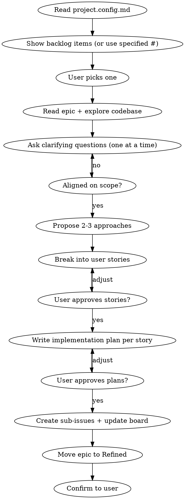

# Refine — Epic to Implementation-Ready Stories

Take a raw epic from Backlog, discuss scope with the user, break it into user stories as sub-issues, and write an implementation plan for each story.

**REQUIRED:** Read `.claude/project.config.md` first to get repo, project, and status settings. If the file doesn't exist, tell the user to run `/setup` first.

The user's input is: $ARGUMENTS

**REQUIRED BACKGROUND:** Use questioning techniques from `superpowers:brainstorming` — one question at a time, multiple choice preferred, propose 2-3 approaches with trade-offs and your recommendation. YAGNI ruthlessly.

**REQUIRED:** Use `superpowers:writing-plans` to create the implementation plan for each story.

## Issue Hierarchy

```
Epic (parent issue, from /idea)
├── User Story (sub-issue, created during /refine)
│   └── Tasks as checkboxes in the story body (plan phases)
├── User Story (sub-issue)
│   └── Tasks as checkboxes
└── ...
```

## Usage

- `/refine` — shows backlog items to pick from
- `/refine 25` — refine issue #25 directly

## Flow



## Process

### 1. Select & Understand
- Read `.claude/project.config.md` for all project settings
- Show Backlog items, or use the issue number provided
- Fetch the current issue body
- Explore relevant parts of the codebase to understand current state

### 2. Discuss (brainstorming techniques)
- Ask clarifying questions **one at a time**
- Prefer **multiple choice** questions when possible
- Focus on: purpose, constraints, success criteria, edge cases
- Once scope is clear, **propose 2-3 approaches** with trade-offs and your recommendation

### 3. Break into User Stories
Split the epic into user stories. Each story should be:
- Small enough for a single implementation session
- Independent enough for a worker agent to execute without context from other stories
- In the format:
  ```
  As a [user type], I want [goal] so that [benefit]

  ## Acceptance Criteria
  - [ ] ...
  - [ ] ...
  ```
Show the proposed stories, adjust until user approves.

### 4. Write Implementation Plans
For each story, invoke `superpowers:writing-plans` to create a detailed plan. The plan should:
- Reference the story's acceptance criteria
- Break work into ordered phases as task checkboxes
- Include relevant file paths, patterns to follow, and technical decisions
- Be self-contained enough for a worker agent to execute without additional discussion

### 5. Create Sub-Issues & Update Board
Once user approves the plans:
- Create each story as a sub-issue of the epic
- Story body contains: user story, acceptance criteria, and full implementation plan with task checkboxes
- Add each sub-issue to the project board in **Backlog** status
- Move the **epic** to **Refined** on the board
- Label stories with area label

## Commands

Read owner, repo, project number, project ID, field ID, and status option IDs from `.claude/project.config.md`.

**List backlog items:**
```bash
gh project item-list <project-number> --owner <owner> --format json
```

**Create sub-issue:**
```bash
# 1. Create the child issue
gh issue create --repo <owner>/<repo> --title "<task title>" --body "<body>" --label "<Area>"

# 2. Get the child issue's node ID
gh api '/repos/<owner>/<repo>/issues/<child_number>' --jq '.node_id'

# 3. Link as sub-issue to epic
gh api --method POST '/repos/<owner>/<repo>/issues/<epic_number>/sub_issues' -f sub_issue_id=<node_id>
```

**Set epic status to Refined:**
Use GraphQL mutation `updateProjectV2ItemFieldValue` with project ID, field ID, and Refined option ID from config.

## Important

- The refinement conversation is the core value — don't rush it
- Each story must be self-contained with its full implementation plan
- A worker agent should be able to pick up any story and start implementing from the checkboxes alone
- Add all sub-issues to the project board in Backlog status
