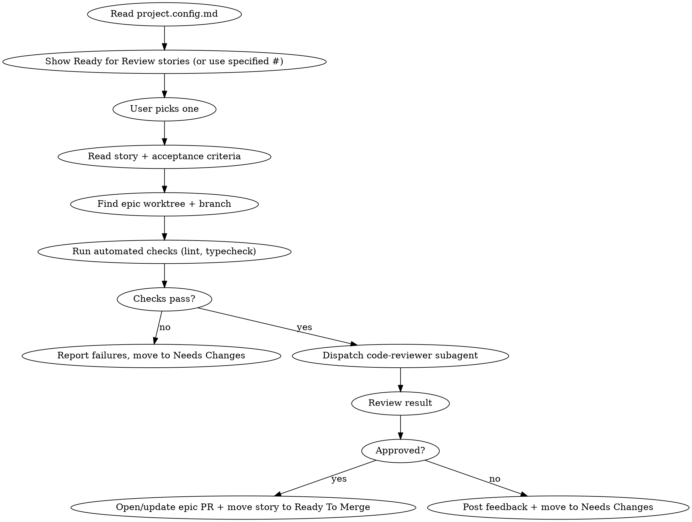

# Review — Review a Story Ready for Review

Pick up a story from Ready for Review, run automated checks, dispatch a code review agent, and either move it to Ready To Merge (opening/updating the epic PR) or to Needs Changes.

**REQUIRED:** Read `.claude/project.config.md` first to get repo, project, build, and status settings. If the file doesn't exist, tell the user to run `/setup` first.

The user's input is: $ARGUMENTS

**REQUIRED:** Use `superpowers:requesting-code-review` to dispatch the code-reviewer subagent.

## Usage

- `/review` — shows stories ready for review
- `/review 31` — review issue #31 directly

## Flow



## Process

### 1. Select Story
- Read `.claude/project.config.md` for all project settings
- If `$ARGUMENTS` contains an issue number, use it directly
- Otherwise, run `~/.claude-helpers/get-issues.sh --stage ready-for-review`, then present the candidates using the `AskUserQuestion` tool. Proceed with the picked number
- Fetch the full issue body (user story, acceptance criteria, implementation plan)

### 2. Find the Worktree
- Identify the parent epic number
- Find the epic's worktree:
  ```bash
  git worktree list | grep "feat/<epic-number>"
  ```
- `cd` into the worktree to run checks from there

### 3. Run Automated Checks
Run lint and typecheck commands from config:
```bash
<lint command from config>
<typecheck command from config>
```

If checks fail:
- Post the failures as a comment on the issue (`gh issue comment`)
- Move story to **Needs Changes**: `~/.claude-helpers/issue-set-stage.sh <story> needs-changes`
- Stop here

### 4. Dispatch Code Reviewer
Use `superpowers:requesting-code-review` to dispatch the code-reviewer subagent.

Get the git range:
```bash
BASE_SHA=$(git merge-base origin/main HEAD)
HEAD_SHA=$(git rev-parse HEAD)
```

Fill the review template with:
- `{WHAT_WAS_IMPLEMENTED}`: The story title and description
- `{PLAN_OR_REQUIREMENTS}`: The acceptance criteria and implementation plan from the issue body
- `{BASE_SHA}`: The merge base
- `{HEAD_SHA}`: Current HEAD
- `{DESCRIPTION}`: Brief summary of what changed

### 5. Act on Review Result

**If APPROVED:**
- Find the parent epic number (via sub-issues API) and the epic branch (`feat/<epic-number>-*`).
- Enumerate all sub-issues of the epic and determine which are now approved (status = `Ready To Merge` or `Done`, plus the current story being approved).
- Build the PR body so the **Linked pull requests** field auto-fills:
  - One `Closes #<story-number>` line per approved story (including the current one).
  - Add `Closes #<epic-number>` only when every sub-issue of the epic is approved.
  - Include a short "Stories included" summary with links.
- Ensure an epic PR is open:
  - Check for an existing open PR from the branch: `gh pr list --repo <owner>/<repo> --head <branch> --state open --json number,url,body --jq '.'`
  - If no PR exists, push the branch (`git push -u origin <branch>`) and create a PR targeting `main` via `superpowers:finishing-a-development-branch`. Title: `<Epic title>`. Body: as built above. After creation, also add the PR to the project board for visibility: `gh project item-add <project-number> --owner <owner> --url <pr-url>`.
  - If a PR already exists, push any new commits (`git push`) and update the PR body via `gh pr edit <number> --repo <owner>/<repo> --body-file <path>` so the `Closes #N` list stays in sync. Add a comment summarizing the newly approved story.
- Verify the story issue now shows the PR in its **Linked pull requests** field on the project board (GitHub derives this from the `Closes #<story>` reference).
- Post a short "Approved" comment on the story issue linking to the PR.
- Move story to **Ready to Merge**: `~/.claude-helpers/issue-set-stage.sh <story> ready-to-merge`

**If CHANGES REQUESTED:**
- Post the review feedback as a comment on the GitHub issue
- Move story to **Needs Changes**: `~/.claude-helpers/issue-set-stage.sh <story> needs-changes`

## Posting Review Feedback

Format the comment as:
```markdown
## Code Review Feedback

### Critical (Must Fix)
- ...

### Important (Should Fix)
- ...

### Minor (Nice to Have)
- ...

### Verdict
[Ready to merge / Needs fixes]
```

## Commands

- **List candidates**: `~/.claude-helpers/get-issues.sh --stage ready-for-review`
- **Post comment**: `gh issue comment <number> --repo <repo> --body-file <path>`
- **Change status**: `~/.claude-helpers/issue-set-stage.sh <num> <stage>` (`ready-to-merge`, `needs-changes`, etc.)

## Important

- Always run lint + typecheck before dispatching the reviewer
- Review against the story's acceptance criteria, not just code quality
- Post feedback as GitHub issue comments so the implementer agent has full context
