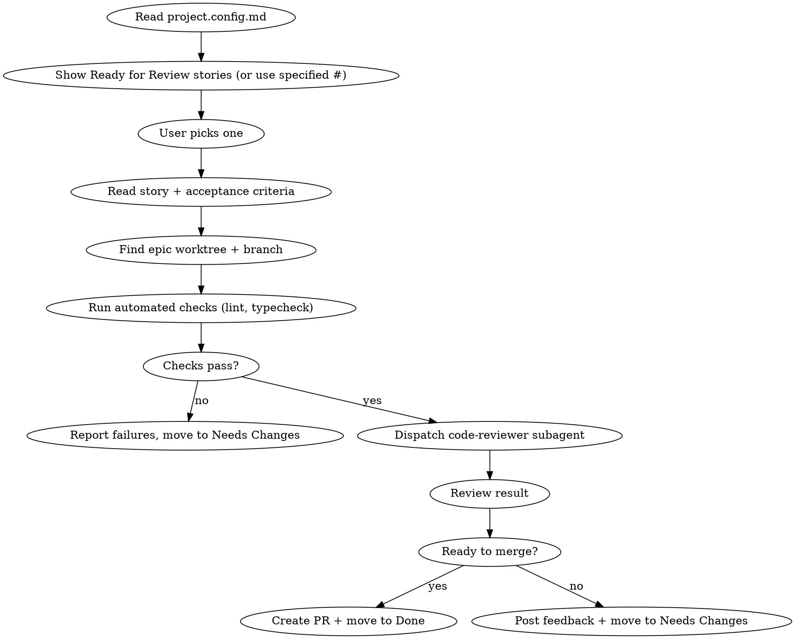

# Review — Review a Story Ready for Review

Pick up a story from Ready for Review, run automated checks, dispatch a code review agent, and move it to Done or Needs Changes.

**REQUIRED:** Read `.claude/project.config.md` first to get repo, project, build, and status settings. If the file doesn't exist, tell the user to run `/setup` first.

The user's input is: $ARGUMENTS

**REQUIRED:** Use `superpowers:requesting-code-review` to dispatch the code-reviewer subagent.

## Usage

- `/review` — shows stories ready for review
- `/review 31` — review issue #31 directly

## Flow



## Process

### 1. Select Story
- Read `.claude/project.config.md` for all project settings
- If no issue number provided, fetch all project items with status "Ready for Review"
- Show them to the user, let them pick
- Fetch the full issue body (user story, acceptance criteria, implementation plan)

### 2. Find the Worktree
- Identify the parent epic number
- Find the epic's worktree:
  ```bash
  git worktree list | grep "feat/<epic-number>"
  ```
- `cd` into the worktree to run checks from there

### 3. Run Automated Checks
Run lint and typecheck commands from config:
```bash
<lint command from config>
<typecheck command from config>
```

If checks fail:
- Post the failures as a comment on the issue
- Move story to **Needs Changes**
- Stop here

### 4. Dispatch Code Reviewer
Use `superpowers:requesting-code-review` to dispatch the code-reviewer subagent.

Get the git range:
```bash
BASE_SHA=$(git merge-base origin/main HEAD)
HEAD_SHA=$(git rev-parse HEAD)
```

Fill the review template with:
- `{WHAT_WAS_IMPLEMENTED}`: The story title and description
- `{PLAN_OR_REQUIREMENTS}`: The acceptance criteria and implementation plan from the issue body
- `{BASE_SHA}`: The merge base
- `{HEAD_SHA}`: Current HEAD
- `{DESCRIPTION}`: Brief summary of what changed

### 5. Act on Review Result

**If "Ready to merge" = Yes:**
- Create a PR using `superpowers:finishing-a-development-branch`
- Move story to **Done** on the board

**If "Ready to merge" = No / With fixes:**
- Post the review feedback as a comment on the GitHub issue
- Move story to **Needs Changes** on the board

## Posting Review Feedback

Format the comment as:
```markdown
## Code Review Feedback

### Critical (Must Fix)
- ...

### Important (Should Fix)
- ...

### Minor (Nice to Have)
- ...

### Verdict
[Ready to merge / Needs fixes]
```

## Commands

Read all IDs from `.claude/project.config.md`.

**Post comment:**
```bash
gh issue comment <number> --repo <owner>/<repo> --body "<feedback>"
```

**Set status to Done / Needs Changes:**
Use GraphQL mutation `updateProjectV2ItemFieldValue` with project ID, field ID, and option IDs from config.

## Important

- Always run lint + typecheck before dispatching the reviewer
- Review against the story's acceptance criteria, not just code quality
- Post feedback as GitHub issue comments so the implementer agent has full context
