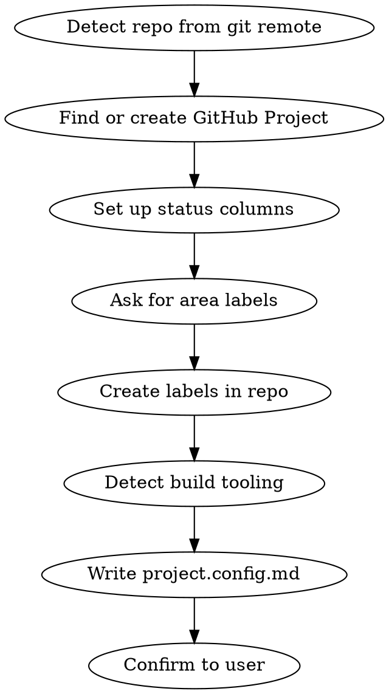

# Setup — Initialize Project Configuration

Set up `.claude/project.config.md` for a new project, enabling all workflow commands (`/idea`, `/refine`, `/board`, `/implement`, `/review`, `/fix`).

The user's input is: $ARGUMENTS

## Flow



## Process

### 1. Detect Repository
```bash
REMOTE=$(git remote get-url origin)
# Parse owner and repo from SSH or HTTPS URL
```

### 2. Find or Create GitHub Project
```bash
gh project list --owner <owner>
```
- If a project exists, ask the user which one to use
- If none exists, create one:
  ```bash
  gh project create --owner <owner> --title "<Repo Name> Roadmap"
  ```
- Fetch project ID and number

### 3. Set Up Status Columns
Query the project's Status field. Ensure these columns exist:
- **Backlog** — Raw ideas
- **Refined** — Scoped with acceptance criteria and tasks
- **In Progress** — Being implemented
- **Ready for Review** — Implementation complete
- **Needs Changes** — Review feedback to address
- **Done** — Reviewed and merged

If the field has different options, update them via GraphQL.

Fetch and store all option IDs.

### 4. Bootstrap Labels (type / stage / area)

This workflow uses a three-dimensional label taxonomy. The `labels-bootstrap.sh` helper creates them all in one go and is idempotent.

Ask the user: **"What area labels do you want? These group your epics (e.g. Frontend, Backend, API, Mobile)."**

Then run:
```bash
~/.claude-helpers/labels-bootstrap.sh --areas "Frontend,Backend,API,Mobile"
```

This creates (skipping any that already exist):
- **Type labels** (`type:epic`, `type:story`, `type:bug`, `type:chore`) — what kind of issue
- **Stage labels** (`stage:backlog`, `stage:refined`, `stage:in-progress`, `stage:ready-for-review`, `stage:needs-changes`, `stage:ready-to-merge`, `stage:blocked`) — where it is in the workflow; mirrors the board Status column
- **Area labels** (`area:<name>`) — which part of the product; one provided by the user per comma

The stage labels enable fast tab-completion and fuzzy-finding via `gh issue list --label` (no GraphQL needed), while the board Status field provides the visual kanban. Helpers keep both surfaces in sync.

### 5. Detect Build Tooling
Auto-detect from project files:
```bash
# Check for package manager
if [ -f pnpm-lock.yaml ]; then INSTALL="pnpm install"
elif [ -f yarn.lock ]; then INSTALL="yarn install"
elif [ -f package-lock.json ]; then INSTALL="npm install"
fi

# Check for monorepo tooling
if [ -f nx.json ]; then RUNNER="nx"
elif [ -f turbo.json ]; then RUNNER="turbo"
fi
```

Ask the user to confirm or adjust the detected commands for:
- **install** — dependency installation
- **lint** — linting
- **typecheck** — type checking
- **test** — test suite

### 6. Write project.config.md
Write the config to `.claude/project.config.md`:

```markdown
# Project Configuration
<!-- Auto-generated by /setup. Rerun /setup to update. -->

## Repository
- owner: <owner>
- repo: <repo>

## GitHub Project
- number: <number>
- id: <project-id>

## Status Field
- field-id: <field-id>
- Backlog: <option-id>
- Refined: <option-id>
- In Progress: <option-id>
- Ready for Review: <option-id>
- Needs Changes: <option-id>
- Done: <option-id>

## Labels
- areas: Label1, Label2, Label3
<!-- type:* and stage:* labels are standardized across all projects — see ~/.claude-helpers/labels.sh -->


## Build Commands
- install: <install command>
- lint: <lint command>
- typecheck: <typecheck command>
- test: <test command>
```

### 7. Confirm
Show the user a summary of what was configured and remind them to commit `.claude/project.config.md` to the repo.

## Re-running /setup
Running `/setup` on a project that already has `project.config.md` will:
- Re-query all IDs from GitHub (re-sync)
- Preserve existing labels and build commands (unless user changes them)
- Overwrite the config file with fresh data

## Important
- Always confirm area labels and build commands with the user before writing
- The config file should be committed to the repo so all collaborators share it
